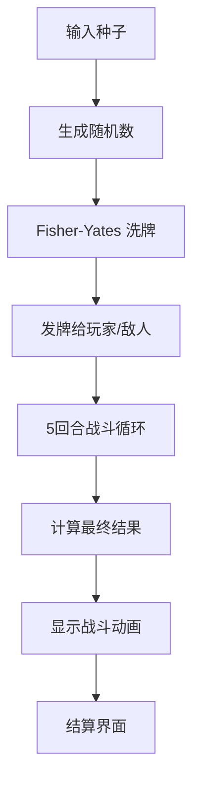

# Fate's Echo — Web3 Casino Platform

<div align="center">
  
  
  
  
  
</div>

## 🌟 项目概述

**Fate's Echo** 是一个基于区块链的可验证随机游戏平台，专为 SC6107 区块链开发课程设计。该项目实现了 **Option 4: On-Chain Verifiable Random Game Platform** 的所有核心要求。

### 🎯 核心特性

- ✅ **可验证随机性**: 集成 Chainlink VRF (计划中)
- ✅ **游戏多样性**: 实现至少 2 种游戏类型
- ✅ **经济系统**: 支持投注和自动派发
- ✅ **公平性验证**: 透明的随机数生成证明
- ✅ **防作弊机制**: Commit-Reveal 模式

### 🎮 当前游戏

#### Fate's Echo (命运回响) — 塔罗牌对战

- **类型**: 塔罗牌自动对战游戏
- **机制**: 种子决定命运的确定性战斗
- **资源**: 78 张塔罗牌 (22 大阿卡纳 + 56 小阿卡纳)
- **玩法**: 5 回合自动战斗，包含事件卡和数值战斗

---

## 🚀 快速开始

### 📋 前置要求

- Node.js 18+
- npm 或 yarn

### 🛠️ 安装与运行

```bash
# 克隆项目
git clone https://github.com/Shr1mpTop/Web3_Casino.git
cd Web3_Casino

# 安装依赖
cd frontend
npm install

# 启动开发服务器
npm run dev
```

访问 `http://localhost:5173` 开始游戏！

### 🏗️ 构建生产版本

```bash
npm run build
npm run preview
```

---

## 🎯 游戏玩法

### Fate's Echo 规则

#### 🎴 卡牌系统

- **大阿卡纳 (Major Arcana)**: 22 张事件卡，具有特殊效果
- **小阿卡纳 (Minor Arcana)**: 56 张战斗卡，包含数值和花色

#### ⚔️ 战斗机制

1. **种子生成**: 输入种子或随机生成
2. **洗牌**: 确定性算法打乱 78 张牌
3. **发牌**: 每回合各抽一张牌进行对决
4. **判定规则**:
   - **双事件卡**: 神仙打架，触发特殊交互
   - **单事件卡**: 事件效果优先触发
   - **数值战斗**: 点数 + 花色克制 (+3 点数加成)

#### 🌟 花色克制

- 🔥 **权杖 (Wands)** → 🌍 **钱币 (Pentacles)**
- 🌍 **钱币 (Pentacles)** → 🌪️ **宝剑 (Swords)**
- 🌪️ **宝剑 (Swords)** → 💧 **圣杯 (Cups)**
- 💧 **圣杯 (Cups)** → 🔥 **权杖 (Wands)**

#### 🎭 事件卡效果示例

- **愚者 (The Fool)**: 闪避本回合伤害
- **死神 (Death)**: 造成 15 点真实伤害
- **塔 (The Tower)**: 双方各承受 10 点伤害
- **世界 (The World)**: 造成 20 点伤害

### 🔮 可验证公平性

每个游戏都基于**种子 (Seed)** 确定性生成：

- 相同种子 = 完全相同的战斗过程
- 前端算法与合约逻辑一致
- 支持第三方验证战斗结果

---

## 🏛️ 架构设计

### 📁 项目结构

```
frontend/                        # 🎮 前端应用
├── src/
│   ├── engine/                   # 🎲 游戏逻辑引擎
│   │   ├── seedEngine.ts         # 确定性随机数生成器
│   │   ├── cardData.ts           # 78张塔罗牌数据定义
│   │   └── battleEngine.ts       # 5回合战斗引擎
│   ├── components/               # ⚛️ React 组件
│   │   ├── GameSetup.tsx         # 游戏设置界面
│   │   ├── BattleScene.tsx       # 战斗场景动画
│   │   ├── CardDisplay.tsx       # 卡牌显示组件
│   │   ├── HealthBar.tsx         # 血条组件
│   │   └── GameOver.tsx          # 结算界面
│   ├── App.tsx                   # 主应用组件
│   └── index.css                 # 🎨 样式 (暗色神秘主题)
├── resources/                    # 🖼️ 塔罗牌图片资源
└── package.json                  # 📦 依赖配置

contracts/                        # 🏛️ 智能合约
├── FateEcho.sol                  # 主游戏合约 (VRF 集成)
├── FateEchoDeployer.sol          # 部署助手合约
└── config.js                     # VRF 配置参数

CONTRACT_README.md                # 📖 合约部署指南
PROJECT_REQUIREMENTS.md           # 📋 课程要求文档
```

### 🔧 技术栈

#### 前端框架
- **React 19**: 现代 React 特性
- **TypeScript**: 类型安全
- **Vite**: 快速构建工具

#### 区块链集成
- **Chainlink VRF v2**: 可验证随机数生成
- **Solidity 0.8.19**: 智能合约开发
- **Sepolia 测试网**: 部署和测试网络

#### 游戏引擎
- **确定性 PRNG**: mulberry32 算法
- **Fisher-Yates 洗牌**: 公平的牌组随机化
- **状态机**: React Hooks 管理游戏状态

#### 样式设计
- **暗色神秘主题**: 金色 accent
- **CSS 动画**: 翻牌、伤害数字、发光效果
- **响应式设计**: 支持移动端

### 🔄 工作流程



---

## 🏛️ 智能合约

### FateEcho.sol - 主游戏合约

基于 **Chainlink VRF v2** 的可验证随机游戏合约：

#### 核心功能
- **VRF 集成**: 请求可验证随机数种子
- **ETH 赌注**: 直接接收 Sepolia ETH 作为赌注
- **确定性战斗**: 使用 VRF 种子重现前端战斗逻辑
- **自动派发**: 获胜者自动领取奖金 (1.9x 倍率，扣除 5% 平台抽成)

#### 合约参数
```solidity
// Sepolia VRF 配置
VRF_COORDINATOR: 0x8103B0A8A00be2DDC778e6e7eaa21791Cd364625
KEY_HASH: 0x474e34a077df58807dbe9c96d3c009b23b3c6d0cce433e59bbf5b34f823bc56c
CALLBACK_GAS_LIMIT: 500000

// 游戏配置
MIN_BET: 0.001 ETH
MAX_BET: 1 ETH
HOUSE_EDGE: 5%
WIN_MULTIPLIER: 1.9x
```

#### 部署步骤
1. 在 [Remix IDE](https://remix.ethereum.org) 中打开 `contracts/FateEcho.sol`
2. 配置你的 Chainlink VRF Subscription ID
3. 部署到 Sepolia 测试网
4. 记录合约地址用于前端集成

#### 详细部署指南
📖 详见 [`CONTRACT_README.md`](CONTRACT_README.md)

## 🎯 开发路线图

### ✅ 已完成 (MVP)

- [x] 纯前端游戏实现
- [x] 确定性战斗算法
- [x] 塔罗牌数据定义
- [x] 战斗动画和 UI
- [x] 可验证公平性证明
- [x] Solidity 智能合约开发 (VRF 集成)
- [x] 经济系统 (ETH 投注/自动派发)
- [x] Sepolia 测试网部署配置

### 🚧 进行中

- [ ] Remix 部署和测试
- [ ] 第二个游戏实现 (Dice/High-Low)

### 🔜 计划中

- [ ] Web3 前端集成 (Wagmi/Ethers)
- [ ] 多链支持 (Amoy 测试网)
- [ ] 完整 dApp 部署

### 🎨 增强功能

- [ ] NFT 塔罗牌收藏
- [ ] 成就系统
- [ ] 排行榜
- [ ] 社交功能

---

## 🔍 核心算法详解

### 种子生成

```typescript
// 使用字符串哈希作为种子
const seedNum = hashString(seedString);
const rng = createRNG(seedNum);
```

### 洗牌算法

```typescript
// Fisher-Yates 确定性洗牌
function shuffle<T>(array: T[]): T[] {
  const arr = [...array];
  for (let i = arr.length - 1; i > 0; i--) {
    const j = rng.nextInt(0, i + 1);
    [arr[i], arr[j]] = [arr[j], arr[i]];
  }
  return arr;
}
```

### 战斗判定

```typescript
// 优先级: 双事件 > 单事件 > 数值战斗
if (bothMajor) {
  // 神仙打架模式
} else if (oneMajor) {
  // 事件效果优先
} else {
  // 数值 + 克制计算
}
```

---

## 🤝 贡献指南

### 开发环境设置

```bash
# 安装依赖
npm install

# 启动开发服务器
npm run dev

# 构建检查
npm run build
```

### 代码规范

- 使用 TypeScript 严格模式
- 组件使用函数式组件 + Hooks
- 游戏逻辑与 UI 分离
- 注释重要算法

### 测试验证

- 相同种子应产生相同结果
- 验证战斗算法的确定性
- 检查 UI 动画流畅性

---

## 📜 许可证

本项目为 SC6107 课程项目，遵循学术诚信原则。

## 🙏 致谢

- **塔罗牌资源**: [Rider-Waite Tarot](https://en.wikipedia.org/wiki/Rider%E2%80%93Waite_Tarot)
- **Chainlink VRF**: 为可验证随机性提供基础设施
- **React & Vite**: 优秀的开发体验

---

<div align="center">
  <p><strong>🌙 Fate's Echo — Where Destiny Meets Blockchain 🌙</strong></p>
  <p>种子决定命运，区块链保证公平</p>
</div>
